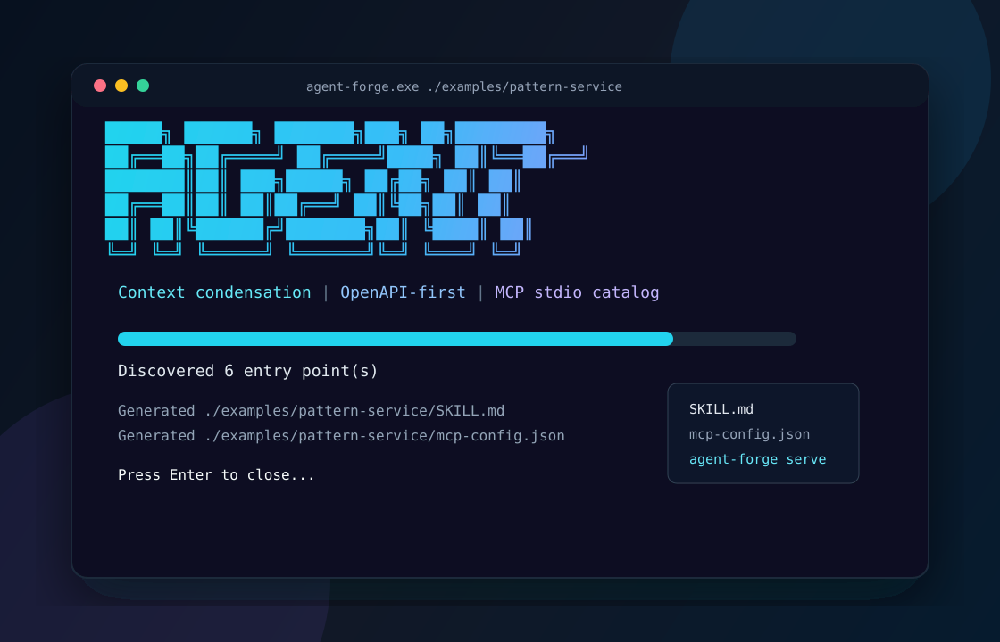
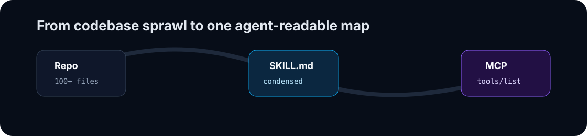
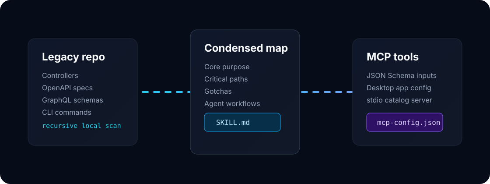

<p align="center">
  
</p>

<h1 align="center">Agent-Forge</h1>

<p align="center">
  Turn a legacy codebase into an agent-readable <code>SKILL.md</code> and MCP tool catalog in one command.
</p>

<p align="center">
  <a href="#quick-start">Quick Start</a>
  · <a href="#how-it-works">How It Works</a>
  · <a href="#mcp-support">MCP Support</a>
  · <a href="#examples">Examples</a>
  · <a href="#development">Development</a>
</p>

<p align="center">
  
  
  
  
</p>

## Why Agent-Forge?

Large repositories are brutal on context windows. Agents burn tokens reading routes, schemas, controllers, comments, and config files before they understand what the codebase actually does.

Agent-Forge gives them a better first read.

It scans the repository locally, extracts the agent-usable entry points, and writes a condensed `SKILL.md` plus an `mcp-config.json` that desktop AI tools can consume.

<p align="center">
  
</p>

## What It Generates

```text
your-repo/
+-- SKILL.md          # The semantic map an agent should read first
+-- mcp-config.json   # MCP tools, JSON Schema inputs, and server config
```

`SKILL.md` includes:

- Core Purpose
- Context Condensation guidance
- Critical Paths
- Common Gotchas
- Example Agent Workflows

`mcp-config.json` includes:

- `mcpServers` config for desktop clients
- Tool names derived from routes, operations, or functions
- JSON Schema `inputSchema` definitions
- Framework, route, method, and source file metadata

## Quick Start

Build the CLI:

```powershell
cargo build --release
```

Preview a generated skill file:

```powershell
.\target\release\agent-forge.exe .\examples\pattern-service --dry-run
```

Generate real files:

```powershell
.\target\release\agent-forge.exe C:\path\to\your\repo
```

Use the interactive setup:

```powershell
.\target\release\agent-forge.exe --interactive
```

Serve an MCP catalog:

```powershell
.\target\release\agent-forge.exe serve C:\path\to\your\repo
```

## How It Works

<p align="center">
  
</p>

Agent-Forge uses a deliberate precedence order:

1. Look for `openapi.yaml`, `openapi.yml`, `openapi.json`, `swagger.yaml`, `swagger.yml`, or `swagger.json`.
2. If a spec exists, treat it as the source of truth.
3. If no spec exists, scan source files with framework matchers.
4. Extract route names, methods, paths, arguments, comments, docstrings, and intent.
5. Render `SKILL.md` and `mcp-config.json` from templates.

The scanner is local-first. It does not send code to a remote model or API.

## Context Condensation

Instead of telling an agent to read the whole repository, Agent-Forge gives it one high-signal file.

When a repo crosses the condensation threshold, the generated `SKILL.md` explicitly tells the agent:

```text
Start with this SKILL.md before opening source files.
```

That means fewer irrelevant file reads, lower token spend, and faster handoff between developers and AI agents.

## MCP Support

Agent-Forge writes a desktop-app-friendly server block:

```json
{
  "mcpServers": {
    "payments": {
      "command": "agent-forge",
      "args": ["serve", "/path/to/payments"]
    }
  }
}
```

The `serve` command exposes a stdio JSON-RPC catalog with:

- `initialize`
- `tools/list`
- `tools/call`

That makes Agent-Forge a bridge between older repositories and MCP-aware tools such as Claude Desktop, Cursor, Windsurf, and similar clients.

## Framework Coverage

| Framework | Signals Agent-Forge Reads |
| --- | --- |
| OpenAPI / Swagger | paths, operations, summaries, parameters, request bodies |
| Express | `app.get`, `router.post`, named handlers, inline comments |
| FastAPI | `@app.get`, `@router.patch`, typed args, Python docstrings |
| Gin | `r.GET`, `router.POST`, handler names, Go comments |
| Spring Boot | `@GetMapping`, `@PostMapping`, method args, JavaDoc |
| GraphQL | `type Query`, `type Mutation`, field args |

## CLI Experience

Agent-Forge is designed to feel good in the terminal:

- Gradient terminal wordmark
- TUI progress indicator
- `--dry-run` preview mode
- `--interactive` setup form
- "Press Enter to close" after generation for double-click workflows
- Clean JSON-only output in `serve` mode

## Examples

This repository includes two tiny test repos:

```powershell
.\target\release\agent-forge.exe .\examples\openapi-billing --dry-run
```

Tests OpenAPI-first behavior. The scanner ignores source routes and uses `openapi.yaml`.

```powershell
.\target\release\agent-forge.exe .\examples\pattern-service --dry-run
```

Tests framework pattern scanning across Express, FastAPI, Gin, and GraphQL.

## Project Structure

```text
agent-forge/
+-- src/
|   +-- cli.rs          # Clap CLI, dry-run/output behavior, progress UI, MCP serve mode
|   +-- generator.rs    # Handlebars rendering and MCP JSON Schema mapping
|   +-- lib.rs          # Public crate modules
|   +-- main.rs         # Binary entrypoint
|   +-- models.rs       # Shared analysis and entry point models
|   +-- openapi.rs      # OpenAPI/Swagger parser
|   +-- scanner.rs      # Recursive walk and framework pattern matchers
+-- templates/
|   +-- SKILL.md.hbs
|   +-- mcp-config.json.hbs
+-- examples/
|   +-- openapi-billing/
|   +-- pattern-service/
+-- docs/assets/
|   +-- agent-forge-terminal.svg
|   +-- agent-forge-flow.svg
|   +-- agent-forge-animated.svg
+-- tests/
    +-- cli_tests.rs
    +-- generator_tests.rs
    +-- scanner_tests.rs
```

## Development

Run tests:

```powershell
cargo test
```

Format:

```powershell
cargo fmt
```

Build release:

```powershell
cargo build --release
```

Smoke-test MCP output:

```powershell
'{"jsonrpc":"2.0","id":1,"method":"tools/list"}' | .\target\release\agent-forge.exe serve .\examples\pattern-service
```

## Roadmap

- Tree-sitter powered AST extraction.
- Auth and environment-variable hint detection.
- Safe execution adapters for selected tool calls.
- Repository-specific gotcha detection from config files.
- Install snippets for Claude Desktop, Cursor, and Windsurf.

## License

MIT
